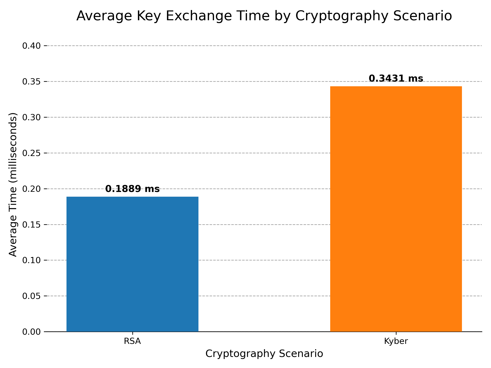

# Reprodutibility Steps

**Requirements**

* Ubuntu LTS +20.04 (22.04 - preferable)
* Containernet - https://github.com/ramonfontes/containernet
* +6.0.0 kernel

## Generate PCAP files automatic

It's possible to generate the PCAP files automatically by running the script `run_topologies.sh`:

```bash
sudo ./run_topologies.sh
```

It will run 10 iterations for each topology and scenario, generating the PCAP files in the `pcap` folder. The script will take a while to finish, as it runs all topologies and scenarios.

## Generate PCAP files manually

To generate the PCAP files manually, the commands may take these arguments:

* `-t` for topology ID (It can be a number between 1 and 12 and is respective to the topologies in the `topologies.py` file)

* `-i` for the iteration number (It can be a number between 1 and 10. 1 by default)

* `-s` for the scenario (It can be `rsa`, `kyber`, or `no_cryptography`. `no_cryptography` by default)

### No Cryptography

Execute the `network.py` file as follows:

`sudo python network.py -t <topo_id> -b`

### RSA

Execute the `network.py` file as follows:

`sudo python network.py -s rsa -t <topo_id> -b`


### Crystals Kyber

Execute the `network.py` file as follows:

`sudo python network.py -s kyber -t <topo_id> -b`


## Gerando resultados

There are two scripts to generate the results from the PCAP files:

1. `compare_key_exchange.py` - This script compares the key exchange times between the RSA and Kyber up to 10 scenarios, generating a graph in the output folder. Graph example:



2. `packet_size_symmetric.py` - This script compares the bandwidth between the RSA and Kyber scenarios, generating a graph in the output folder. Graph example:


